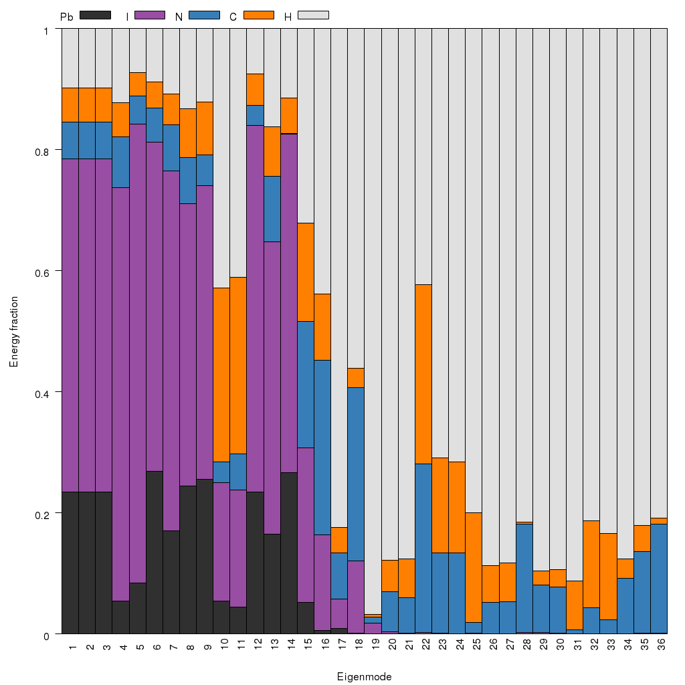

# Julia-Phonons

Codes to play with Phonons, as output from Phonopy, in Julia.

A work in progress.

Currently reads a mesh.yaml from a Phonopy calculation (Gamma only, save eigenvectors); and a 
VASP POSCAR file on this structure, to collect coordinate and atom information.

## Features

* 'Animated' .xyz files, with or without supercell expansion.
* Decomposition to individual atoms, norm of Energy or Displacement weighted phonon eigenvectors
* Decomposition to atom type, for generating %fractional contribution of structure to phonon modes

## Future plans

* Symmetry / mode analysis
* Maybe with these exciting new 'distortion antisymmetry' ideas: http://dx.doi.org/10.1038/ncomms9818
